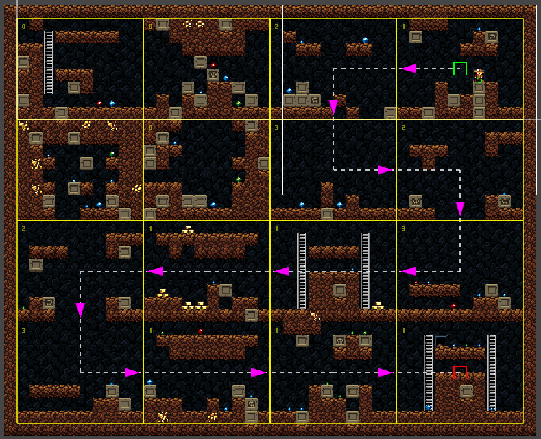

# Spelunkys Level Generator (WIP)
Implementation of Spelunkys procedural level generator in Unity.  
Based on Game Maker's toolkit amazing video explaining how the levels are generated:  
https://www.youtube.com/watch?v=Uqk5Zf0tw3o
### Preview
  
## Prerequisites
- Unity 2019.3.0f6 or higher
## Packages used
- Universal Render Pipeline 7.1.8  
- Cinemachine 2.6.3
## How to run the project
After downloading the repository, open the root project folder with unity, open the Sample scene and press the Play button.
## Credits
Author: Pol Lozano Llorens
